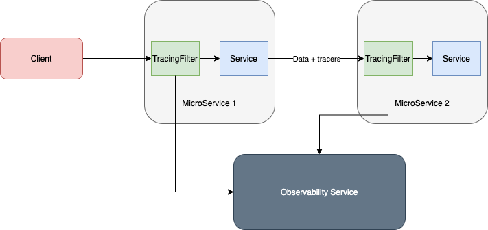

# Observability For Distributed MicroServices

####[Approach Rationale](docs/Decision-Process.md)

A fairly basic implementation of the selected approach can be seen below.

In this implementation, 
- A Servlet filter (zipkin-filter) is injected into all webapps running on top of a Servlet Container. The Filter intercepts all incoming HTTP Requests, detects tracers embedded in them, and if not, add them and passes them along.
- The Service detect the tracers embedded and uses them when making outbound calls.
- Once the control has returned to the Filter at the end of the transaction, the transactions metrics (Span in zipkin terms) is reported to the Observability Service.

##### Prerequisites to run the Demo
1. Java 8
2. Maven 3.4+
3. Docker 19+

If Java and Maven are not available, prebuilt Docker images can be used to run the demo as well.