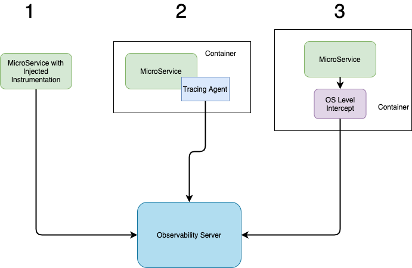

# Design Decisions and Rationale

### Problem Statement

#### What
MyOrg requires a standard mechanism, libraries and other components to be able to enable tracing and diagnostics across its always-growing stable of polyglot microservices.

#### Why
With Distributed services, it often becomes quite complex very quickly to pinpoint the cause of a problem, and to determine any impending failure, as Transactions criss-cross the entire gamut of microservices. With tracing enabled, bottlenecks and painpoints can be detected with very less effort, and can even be automated to some extent when triaging issues.

#### Assumptions
1. We only want to address Tracing as part of this exercise, and not other aspects, such as Overall health monitoring.

### Decisions

#### Observability Provider
##### Overview
Application Performance Monitoring (APM) is a Billion Dollar industry, with competing products from major ISVs, Public Cloud Offerings, and OpenSource. Some of them are
- Commercial: [AppDynamics](https://www.appdynamics.com/), [NewRelic](https://newrelic.com/), [DynaTrace](https://www.dynatrace.com/) etc
- Public Cloud: [AWS CloudWatch](https://aws.amazon.com/cloudwatch/), [Azure Monitor](https://docs.microsoft.com/en-us/azure/azure-monitor/overview), [Oracle OMC](https://docs.oracle.com/en/cloud/paas/management-cloud/index.html) etc
- OpenSource: [Jaeger](https://www.jaegertracing.io/), [Zipkin](https://zipkin.io/) etc

##### Chosen solution and rationale
- Solution: Zipkin
- Rationale: As this is a time-bound exercise, only cursory evaluations of the solutions could be done.
  1. Public Cloud offerings were summarily discounted owing to their portability related difficulties across cloud.
  2. OpenSource was preferred over Commercial, even though commercial offerings at least are just as good, in not better compared to the open-source alternative. The prefernce was due to the fact that there was more OpenSource community contribution towards ancillary components, which is helpful when developing a custom component. 
  3. Zipkin was decided as the solution of choice, owing to the fact that it did one thing(Tracing), and did it very well. However, using Jaeger could have been just as easy, and it's also possible to switch up the implementation if we use another layer of abstraction, e.g. OpenTelementry/OpenTracing, which can be configured to export to either.

#### Observability Instrumentation
##### Overview
While tracing can be achieved in multiple approaches, the results are going to vary because of the capabilities and flaws inhenrent to the approach.

|Sl No|Approach|Pros|Cons|
|---|---|---|---|
|1|MicroService With Injected Instrumentation|<ul><li>Lower Effort in developing the instrumentation library</li><li>High Granularity</li><li>More Control</li><li>Context Aware</li></ul>|<ul><li>Not all libraries are instrumented</li><li>Higher Dev and maintenance effort</li><li>Not a polyglot approach</li><li>Sometimes it can be highly invasive</li></ul>| 
|2|Instrumentation with help of an agent|<ul><li>Medium effort in developing the agent</li><li>Medium effort on Integration and maintenance</li><li>Medium Control</li><li>Mostly arch/framework independent</li></ul>|<ul><li>Not all transactions are instrumented</li><li>Not a polyglot approach</li></ul>| 
|3|Instrumentation OS level service/component|<ul><li>Very low effort in integration and maintenance</li><li>Truly polyglot</li><li>Arch/framework independent</li><li>Truly non-invasive</li></ul>|<ul><li>Transactions not hitting network may not be tracked</li><li>high effort in developing the OS/Network level intercept</li></ul>| 

##### Chosen Approach and rationale
- Approach: MicroService With Injected Instrumentation	
- Rationale: While the above approach doesn't fit the requirement of being non-invasive in nature, it can reasonably be attempted to implement the basic features needed for tracing in this time-bound exercice.